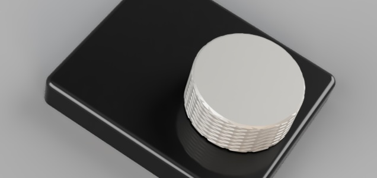

# TTGO Sonos Volume Controller



ESP32-based hardware volume knob for Sonos speakers using a TTGO T-Display board.

## Features

- Large volume display on TFT screen
- Rotary encoder for smooth volume adjustment
- Encoder button toggles play/pause
- Built-in buttons as fallback (up/down with auto-repeat)
- WiFi connectivity to Sonos via UPnP/SOAP

## Hardware

- **Board**: TTGO T-Display (ESP32 with 1.14" TFT, 240x135)
- **Rotary encoder**: CLK → GPIO25, DT → GPIO26, SW → GPIO27
- **Built-in buttons**: GPIO35 (A), GPIO0 (B)

## Project Structure

```
ttgo_counter/
├── ttgo_counter.ino   # Main sketch (UI, buttons, WiFi)
├── config.h           # Configuration (excluded from git)
├── config.h.example   # Configuration template
├── sonos.h            # Sonos API declarations
├── sonos.cpp          # Sonos UPnP/SOAP implementation
└── README.md
```

## Dependencies

Install via Arduino Library Manager:

| Library | Purpose |
|---------|---------|
| TFT_eSPI | Display driver |
| WiFi | ESP32 WiFi (built-in) |
| HTTPClient | HTTP requests (built-in) |

### TFT_eSPI Configuration

In `User_Setup_Select.h`, enable:
```cpp
#include <User_Setups/Setup25_TTGO_T_Display.h>
```

## Configuration

Copy `config.h.example` to `config.h` and edit:

```cpp
// WiFi
static const char* WIFI_SSID = "YourNetwork";
static const char* WIFI_PASSWORD = "YourPassword";

// Sonos
static const char* SONOS_IP = "192.168.x.x";  // Your Sonos speaker IP
static const int SONOS_PORT = 1400;
static const int VOLUME_STEP = 1;

// Hardware
static const int BUTTON_A_PIN = 35;
static const int BUTTON_B_PIN = 0;
static const int ENCODER_CLK_PIN = 25;
static const int ENCODER_DT_PIN = 26;
static const int ENCODER_SW_PIN = 27;

// Display
static const uint8_t DISPLAY_ROTATION = 1;
static const bool DISPLAY_INVERT = true;

// Timing
static const uint32_t DEBOUNCE_MS = 35;
static const uint32_t LONG_PRESS_MS = 700;
static const uint32_t REPEAT_INTERVAL_MS = 300;
```

Note: `config.h` contains credentials and is excluded from version control.

## Usage

- **Encoder rotation**: Volume up/down
- **Encoder button**: Play/pause toggle
- **Button A (GPIO35)**: Volume up (fallback)
- **Button B (GPIO0)**: Volume down (fallback)
- Hold built-in buttons for auto-repeat

Single-button mode activates automatically if only one built-in button is detected.
